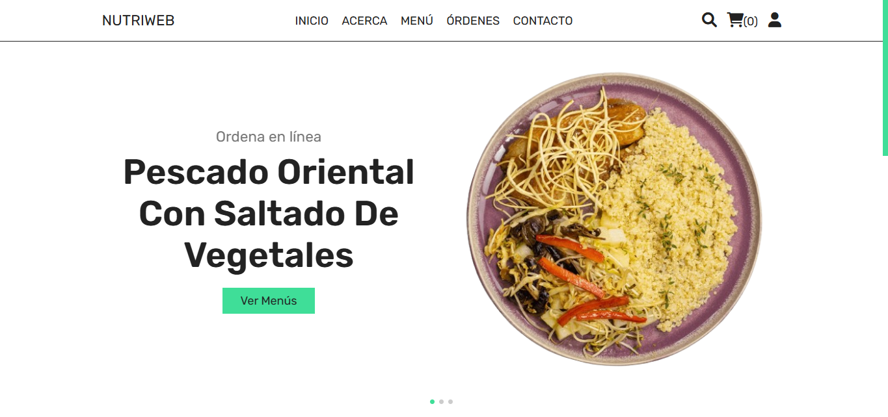

# NutriWeb

## Descripción

**NutriWeb** es una plataforma web dedicada a ofrecer comidas y recetas saludables adaptadas a las necesidades y preferencias del usuario. Nuestro objetivo es ayudar a las personas a llevar un estilo de vida más saludable de manera fácil y conveniente.

## Tecnologías Utilizadas


## Demo

Puedes ver una demostración en vivo de la página web [aquí](http://nutriweb.wuaze.com/).

## Captura de Pantalla 



## Características

- **Planes de Comidas:** Obtén planes de comidas adaptados a tus necesidades dietéticas y estilo de vida.
- **Recetas Saludables:** Explora una colección de recetas deliciosas y saludables.

## Instalación

1. Clona este repositorio:
   ```bash
   git clone https://github.com/tuusuario/nutriweb.git

2. Navega al directorio:
    ```bash
    cd nutriweb

3. Inicia el servidor.

4. Abre tu navegador web y visita http://localhost para ver la plataforma en acción.

## Licencia

Este proyecto está licenciado bajo la Licencia MIT. Consulta el archivo LICENSE para obtener más detalles.

## Contacto

Para cualquier pregunta o sugerencia, por favor contacta a nuestro equipo en lima.saludable2024@gmail.com.